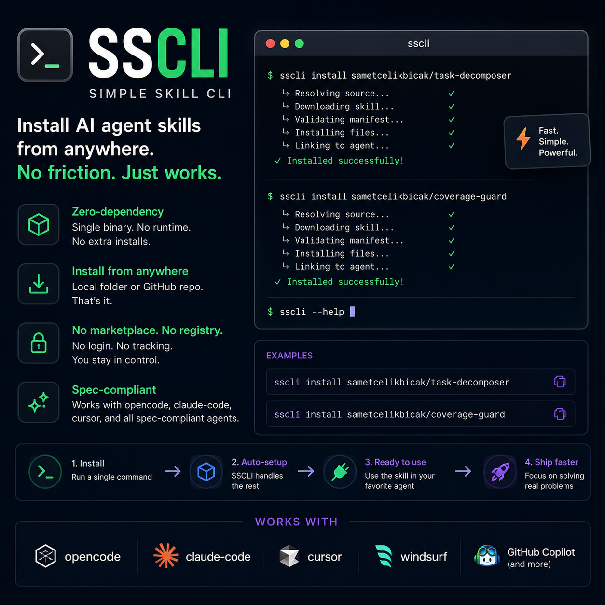

<div align="center">
 

# sscli — Simple Skill CLI

 </div>

**Zero-dependency** CLI to install AI agent skills directly from any source. No marketplace, no registry, no signup — just point it at a local folder or a GitHub repo and it works.

Works with **opencode**, **claude-code**, **cursor**, and all spec-compliant agents.

## Why sscli?

| Feature                           | sscli           | `npx add-skill` | `@agentskill.sh/cli` |
| --------------------------------- | ---------------- | --------------- | -------------------- |
| Zero dependencies                 | ✅               | ✅              | ❌ (2)               |
| Local path install                | ✅ **1st class** | ❌ GitHub only  | ❌ marketplace only  |
| GitHub repo install               | ✅               | ✅              | ❌                   |
| Offline capable                   | ✅               | ❌              | ❌                   |
| agentskill.sh lockfile compatible | ✅               | ✅              | ✅                   |
| Project-level install             | ✅               | ✅              | ✅                   |
| File size                         | ~3 KB            | ~500 KB+        | ~84 KB               |

## Install

```bash
npm install -g sscli
# or
npx sscli install <source>
```

## Usage

```bash
sscli install ./path/to/my-skill          # install from local folder
sscli install sametcelikbicak/task-decomposer  # install from GitHub
sscli list                                 # list installed skills
sscli remove <slug>                        # remove a skill
```

### Install scope

When you run `sscli install <source>` without flags, it asks where to install:

```
Where do you want to install this skill?
  1) Global (~/.agents/skills/) [default]
  2) Project (./.agents/skills/)
  3) Both
```

Use flags to skip the prompt:

```bash
sscli install ./my-skill --global    # ~/.agents/skills/
sscli install ./my-skill --project   # ./.agents/skills/
sscli install ./my-skill --claude    # also ~/.claude/skills/
sscli install ./my-skill --all       # all locations
```

### Source types

**Local path** — any directory containing `SKILL.md`:

```bash
sscli install ./my-skill
sscli install ~/projects/my-skill
sscli install /absolute/path/to/skill
```

**GitHub repo** — shorthand `owner/repo`:

```bash
sscli install sametcelikbicak/task-decomposer
sscli install sametcelikbicak/coverage-guard
```

The CLI clones with `--depth 1`, finds `SKILL.md` recursively, installs it, and cleans up.

<div align="center">
 
 </div>
 
## What it does

1. Reads `SKILL.md` from the source and parses metadata (slug, name, owner)
2. Copies all files alongside `SKILL.md` (references, configs, assets) to the target directory
3. Updates `~/.agents/.skill-lock.json` so agents can discover the skill
4. Compatible with skills installed by `@agentskill.sh/cli`, `add-skill`, or manual installs

## How agents discover skills

| Agent       | Directory                                  |
| ----------- | ------------------------------------------ |
| opencode    | `~/.agents/skills/` or `./.agents/skills/` |
| claude-code | `~/.claude/skills/` or `./.claude/skills/` |
| cursor      | `~/.cursor/skills/` or `./.cursor/skills/` |

## Commands

| Command                   | Description                       |
| ------------------------- | --------------------------------- |
| `sscli install <source>` | Install a skill (local or GitHub) |
| `sscli list`             | Show all installed skills         |
| `sscli remove <slug>`    | Uninstall a skill                 |
| `sscli help`             | Show this help                    |

## Project structure

```
sscli/
├── bin/sscli.js          # CLI entry point
├── src/
│   ├── commands/
│   │   ├── install.js     # install logic + interactive scope
│   │   ├── list.js        # list installed skills
│   │   └── remove.js      # remove skill + lockfile cleanup
│   └── utils/
│       ├── resolver.js    # source resolver (local / GitHub)
│       ├── installer.js   # copy files to target dirs
│       └── lockfile.js    # read/write .skill-lock.json
├── package.json
└── README.md
```

## License

MIT
